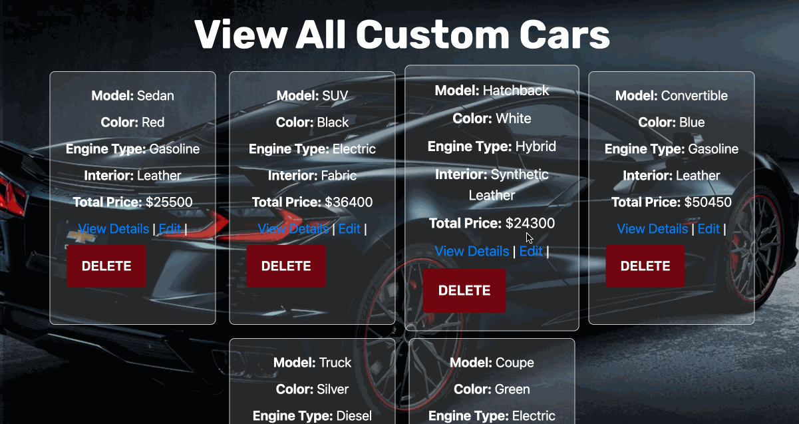

# Personalize It Web App

## About The Project


This web application allows users to create, customize, and manage their own custom cars. By selecting different features like model, color, engine type, and interior, users can build a car that fits their preferences. The app dynamically updates the total price as users select their desired features, providing a real-time car-building experience.

- **Real-Time Price Calculation**: The price of the car updates dynamically based on selected features.
- **Comprehensive Feature Options**: The app allows customization from a wide variety of models, colors, engine types, and interior options.
- **Data Persistence**: Users can create cars, view a list of submitted custom cars, and even edit or delete them from the interface.

<p align="right">(<a href="#readme-top">back to top</a>)</p>

### Built With

The app is built with modern technologies for both the front and back end:

* [![React][React.js]][React-url]
* [![Node.js][Node.js]][Node-url]
* [![Express.js][Express.js]][Express-url]
* [![PostgreSQL][PostgreSQL]][PostgreSQL-url]

<!-- MARKDOWN LINKS & IMAGES -->
[React.js]: https://img.shields.io/badge/React-20232A?style=for-the-badge&logo=react&logoColor=61DAFB
[React-url]: https://reactjs.org/
[Node.js]: https://img.shields.io/badge/Node.js-43853D?style=for-the-badge&logo=node-dot-js&logoColor=white
[Node-url]: https://nodejs.org/
[Express.js]: https://img.shields.io/badge/Express.js-000000?style=for-the-badge&logo=express&logoColor=white
[Express-url]: https://expressjs.com/
[PostgreSQL]: https://img.shields.io/badge/PostgreSQL-316192?style=for-the-badge&logo=postgresql&logoColor=white
[PostgreSQL-url]: https://www.postgresql.org/

<p align="right">(<a href="#readme-top">back to top</a>)</p>

## Getting Started

Follow the steps below to get a local copy of the project up and running.

### Prerequisites

You need <b>Node.js</b> and <b>npm</b> installed on your machine:

```sh
npm install npm@latest -g
```

### Installation

1. Clone the repo:

   ```sh
   git clone https://github.com/cherylnguyenm/Personalize-It.git
   ```

2. Install dependencies:
    ```sh
   npm install
   ```

3. Set up the environment variables for your database and API keys. Create a `.env` file and configure the following:
    ```sh
    DB_HOST=your_database_host
    DB_USER=your_database_user
    DB_PASSWORD=your_database_password
    DB_NAME=your_database_name
    ```

4. Start the development server:
    ```sh
    npm start
    ```
### Contact
Chau Anh Nguyen 

Project Link: https://github.com/cherylnguyenm/Personalize-It

<p align="right">(<a href="#readme-top">back to top</a>)</p>
